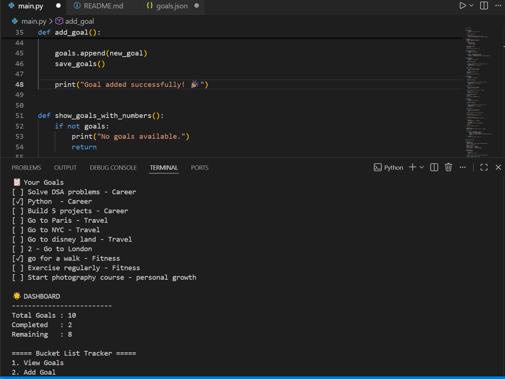
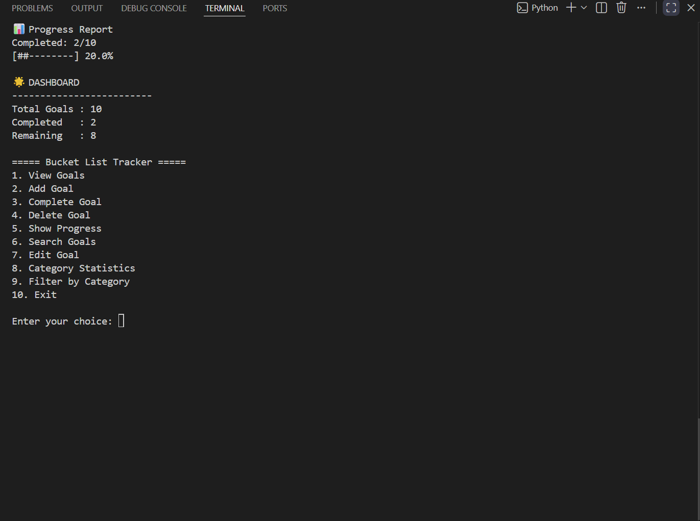
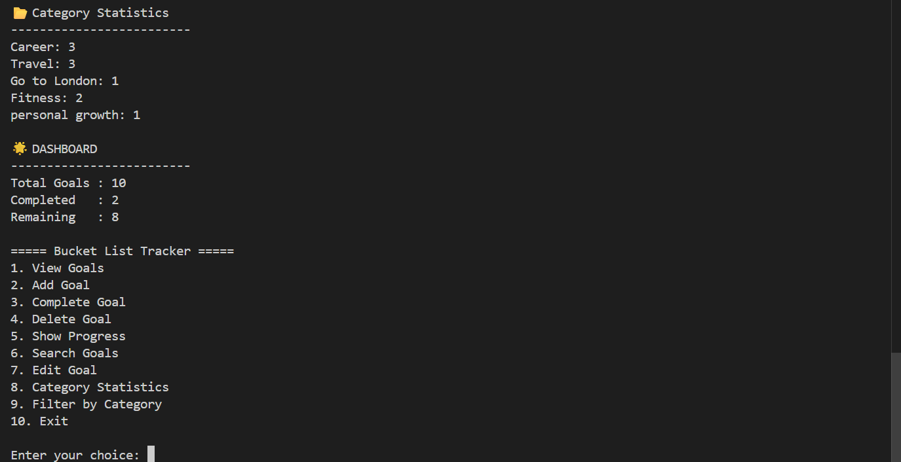

# 🎯 Bucket List Tracker

A command-line application built with Python that helps users manage personal goals, track progress, and stay organized.

This project allows users to add, edit, complete, delete, search, and categorize goals while automatically saving data using JSON storage.

---

## ✨ Features

- ➕ Add new goals
- 📋 View all goals
- ✏️ Edit existing goals
- ✅ Mark goals as completed
- 🗑️ Delete goals
- 🔍 Search goals by keyword
- 📂 Filter goals by category
- 📊 Track completion progress
- 📈 View category statistics
- 💾 Automatic JSON data storage
- ⚠️ Input validation for a smoother user experience

---

## 🛠️ Technologies Used

- Python
- JSON
- File Handling
- Functions
- Lists & Dictionaries
- Exception Handling

---

## 📂 Project Structure

```text
bucket-list-tracker/
│
├── main.py
├── goals.json
├── README.md
├── screenshot1.png
├── screenshot2.png
└── screenshot3.png
```

---

## 🚀 How to Run

1. Clone the repository

```bash
git clone https://github.com/Akshitasetia/bucket-list-tracker.git
```

2. Open the project folder

```bash
cd bucket-list-tracker
```

3. Run the program

```bash
python main.py
```

---

## 📸 Screenshots

### 🧾 Goals Management


### 📊 Progress Tracking


### 📂 Category Statistics



---

## 🎯 Learning Outcomes

Through this project, I practiced:

- Working with JSON files
- File handling in Python
- Data persistence
- Input validation
- Using functions effectively
- Working with lists and dictionaries
- Building a complete menu-driven application

---

## 🔮 Future Improvements

- Goal priorities
- Due dates
- Export goals to CSV
- Achievement badges
- Enhanced terminal UI

---

## 👩‍💻 Author

**Akshita Setia**

Built as a personal Python project to practice programming and software development fundamentals.

---

⭐ If you like this project, consider giving it a star!
